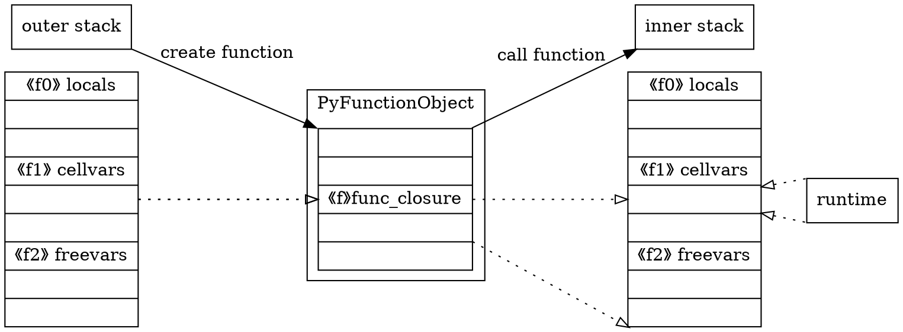

## 什么是闭包
闭包`closure`指的是引用了上层函数作用域的变量。当编程语言支持函数能够作为返回值，则闭包的实现则不可或缺，在函数内定义的子函数引用了父函数的变量，就是使用了语言的闭包特性。python中，一个通常会令人困惑的例子如下：

```python
def generate_funcs():
	ret = []
	for i in range(10):
		def new_func():
			print i
		ret.append(new_func)
	return ret

for func in generate_funcs():
	func()
    
// output
// 9
// 9
// ...
```

大多数初学者的直觉反应，程序最终会依次输出0到9，然而最终所有的函数都输出了9。因为闭包所绑定的是变量的名字，而不是变量的值，变量真正的值需要在运行时才能够确定。而当运行这几个内部函数时，变量`i`已经走完了循环，定格在了`9`这个值。如果想要绑定值，可以使用函数的默认参数来进行传递。

<!-- more -->

## Python 2/3的闭包区别

在python 2中，是不允许修改闭包获得的变量值的，或者说，一旦你修改了值，python将不再认为该变量是外部作用域中的变量，而是内部作用域的新变量。这是因为python的**变量赋值即声明**，光凭借一句赋值语句无法判断变量的作用域，因此默认都为最内层作用域的变量。

python 2中，在没有写操作时，变量的查找依照LEGB的命名空间查找规则，即local->enclosing->global->built-in的查找顺序，当局部命名空间内不存在变量时，python会首先判断是否是闭包。需要注意的是，闭包的变量名是在编译期决定的，闭包获得的变量只与代码所在的上下文相关。

而在python 3中，新增了`nonlocal`关键字，用该关键字声明后可对闭包变量进行赋值操作，因为不会再产生上述的歧义，即不会再认为是新变量的声明语句。


## MAKE_CLOSRE指令

这里不得不吐槽一下，python 2中为了实现闭包，对使用了闭包的函数专门有一条创建指令`MAKE_CLOSURE`，而普通函数，正如之前的博客中所属，是通过`MAKE_FUNCTION`创建的。

```python
>>> def func():
...     a = 1
...     def g():
...             print a
...
>>> dis.dis(func)
  2           0 LOAD_CONST               1 (1)
              3 STORE_DEREF              0 (a)

  3           6 LOAD_CLOSURE             0 (a)
              9 BUILD_TUPLE              1
             12 LOAD_CONST               2 (<code object g at 00D51D58, file "<stdin>", line 3>)
             15 MAKE_CLOSURE             0
             18 STORE_FAST               0 (g)
             21 LOAD_CONST               0 (None)
             24 RETURN_VALUE
```


```c
TARGET(MAKE_CLOSURE)
{
    v = POP(); /* code object */
    x = PyFunction_New(v, f->f_globals);
    Py_DECREF(v);
    if (x != NULL) {
        v = POP();
        if (PyFunction_SetClosure(x, v) != 0) {
            /* Can't happen unless bytecode is corrupt. */
            why = WHY_EXCEPTION;
        }
        Py_DECREF(v);
    }
   /* 后面和MAKE_FUNCTION几乎一致，不再摘抄 */
}
```

可以发现，`MAKE_CLOSURE`和`MAKE_FUNCTION`的实现几乎完全一样，唯一的不同就是多了`PyFunction_SetClosure`的操作，可以简单理解为`x.func_closure = v`。而`PyFunction_SetClosure`所设置的值则是由指令`LOAD_CLOSURE`获取的，这一条指令看上去也非常简单，只是将当前栈帧的`freevars`中的一些值打包成了`tuple`。（注意这里的`freevars`对应的是`co_cellvars`加上`co_freevars`，真正加载到栈空间的其实是`cellvars`）

```c
// freevars = f->f_localsplus + co->co_nlocals;
TARGET(LOAD_CLOSURE)
{
	x = freevars[oparg];
	Py_INCREF(x);
	PUSH(x);
	if (x != NULL) DISPATCH();
	break;
}
```


## freevars和cellvars

`freevars`又是什么呢？在之前的代码中，`freevars`被设置为了`f->f_localsplus + co->co_nlocal`，似乎是栈空间的局部变量之后的一段空间，这一段空间在函数执行的时候会被初始化，具体的代码在`PyEval_EvalCodeEx`中。

```c
/* Allocate and initialize storage for cell vars, and copy free
   vars into frame.  This isn't too efficient right now. */
if (PyTuple_GET_SIZE(co->co_cellvars)) {
    int i, j, nargs, found;
    char *cellname, *argname;
    PyObject *c;

    nargs = co->co_argcount;
    if (co->co_flags & CO_VARARGS)
        nargs++;
    if (co->co_flags & CO_VARKEYWORDS)
        nargs++;

    /* Initialize each cell var, taking into account
       cell vars that are initialized from arguments.

       Should arrange for the compiler to put cellvars
       that are arguments at the beginning of the cellvars
       list so that we can march over it more efficiently?
    */
    for (i = 0; i < PyTuple_GET_SIZE(co->co_cellvars); ++i) {
        cellname = PyString_AS_STRING(
            PyTuple_GET_ITEM(co->co_cellvars, i));
        found = 0;
        for (j = 0; j < nargs; j++) {
            argname = PyString_AS_STRING(
                PyTuple_GET_ITEM(co->co_varnames, j));
            if (strcmp(cellname, argname) == 0) {
                c = PyCell_New(GETLOCAL(j));
                if (c == NULL)
                    goto fail;
                GETLOCAL(co->co_nlocals + i) = c;
                found = 1;
                break;
            }
        }
        if (found == 0) {
            c = PyCell_New(NULL);
            if (c == NULL)
                goto fail;
            SETLOCAL(co->co_nlocals + i, c);
        }
    }
}
if (PyTuple_GET_SIZE(co->co_freevars)) {
    int i;
    for (i = 0; i < PyTuple_GET_SIZE(co->co_freevars); ++i) {
        PyObject *o = PyTuple_GET_ITEM(closure, i);
        Py_INCREF(o);
        freevars[PyTuple_GET_SIZE(co->co_cellvars) + i] = o;
    }
}
```

可以发现，`freevars`地址存放的变量实际上和`func_code`域中的`code_freevars`和`code_cellvars`变量相关。其中：

- `code_cellvars`存放了内层函数引用的当前作用域的变量名，即变量名`a`在`func.func_code.code_cellvars`中
- `code_freevars`存放了当前作用域引用的上层作用域的变量名， 即变量名`a`在`g.func_code.code_freevars`中

注意到，在函数开始执行之前，`co_cellvars`对应的值是不确定的，通常都被初始化为空（引用函数参数作为闭包的`co_cellvars`会有初始值），而`co_freevars`对应的值已经确定了，其实就来自于`func_closure`域，结合之前对`LOAD_CLOSURE`指令的分析，我们发现`func_closure`域其实就来自于上一个栈帧的`co_cellvars`。




## PyCellObject

需要注意的是，`cellvars`和`freevars`中存放的变量并不是简单的`PyObject *`，而是通过`PyCellObject`进行了简单的封装，对其的加载和赋值也都有单独的指令，这样做的原因是为了实现**对变量引用**的闭包。如上面的图例所展现的那样，在创建函数的时候就会将当前栈帧的`cellvars`拷贝到`func_closure`中，如果创建函数后重新对闭包引用的变量赋值，不使用`PyCellObject`就无法捕获到这一变化。

```c
typedef struct {
	PyObject_HEAD
	PyObject *ob_ref;	/* Content of the cell or NULL when empty */
} PyCellObject;

TARGET(LOAD_DEREF)
{
    x = freevars[oparg];
    w = PyCell_Get(x);
    if (w != NULL) {
        PUSH(w);
        DISPATCH();
    }
    err = -1;
    /* Don't stomp existing exception */
    if (PyErr_Occurred())
        break;
    if (oparg < PyTuple_GET_SIZE(co->co_cellvars)) {
        v = PyTuple_GET_ITEM(co->co_cellvars,
                             oparg);
        format_exc_check_arg(
            PyExc_UnboundLocalError,
            UNBOUNDLOCAL_ERROR_MSG,
            v);
    } else {
        v = PyTuple_GET_ITEM(co->co_freevars, oparg -
                             PyTuple_GET_SIZE(co->co_cellvars));
        format_exc_check_arg(PyExc_NameError,
                             UNBOUNDFREE_ERROR_MSG, v);
    }
    break;
}

TARGET(STORE_DEREF)
{
    w = POP();
    x = freevars[oparg];
    PyCell_Set(x, w);
    Py_DECREF(w);
    DISPATCH();
}
```

用类似的python例子来类比，`PyCellObject`就像一个容器，对应的就是绑定的变量名，而变量名对应的对象的变化，也就是`PyCellObject`持有的引用的变化。

```python
# closure by value
a = 1
b = a
a = 2

# closure by reference
a = [1]
b = a
a[0] = 2
```

