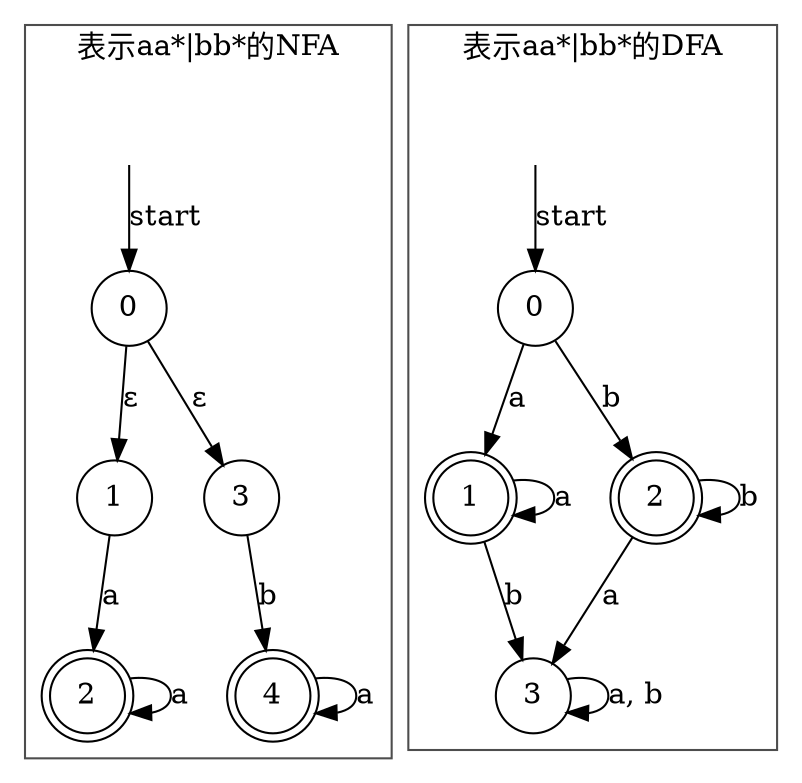

### 一些无关的感想
最近在看编译原理龙书，词法分析一章看的差不多了，但仍然处于一种似懂非懂的状态，这又让我想起，大学期末考试之前复习的时候，反而是我能够真正将所有知识串联起来，融汇贯通的时候，这也就是总结和复习的重要性，因而萌生了将最近的所学所想总结一下的想法。另外，这两天忙里偷闲一直在看[云风的博客](https://blog.codingnow.com/)，十分佩服，更加坚定了总结与记录的念头。

### 词法分析的作用
词法分析是编译过程的第一阶段，它接触到的是第一手的程序源代码。它只处理词法而不处理语法，也就是他不在意串的含义，只在意串的**模式**，但实际上这是一种简化，因为计算机识别不了语义，只能用转化为识别模式。就像收营员结账用的条形码扫描机，扫描机并不知道你买的到底是什么东西，它只知道符合某种**模式**的条形码，以此来区分不同类型的物品。而不同的物品有不同的条形码这样的前提条件，也就是不同语义的串有不同的模式，是需要设计者来保证的。

也就是说，词法分析的作用是识别出程序代码中具有某种模式的串。再类比一下，就是从一串潘多拉手链中识别出每颗珠子的类型。（注意珠子之间可能有联系，可能多颗珠子合起来才是一个配件）

<!-- more -->


举个例子，一行C代码经过词法分析器，会得到一组分散的**词法单元**序列

- input
``` C
printf("%d", a);
```

- output
```
<printf, id> <(> <%d, literal> <,> <a, id> <)> <;>
```

output中的每个尖括号内都是一组词法单元，也就是这个串的含义和它的类型。printf和a都是变量名，这里用id来表示类型，%d是一个字符串常量，这里用literal来表示类型。其他的符号的类型只包含他们自身，因此省略了类型这一项，因为他们的值和类型可以是一样的。类型更加专业的描述为**词法单元名**，值更专业的描述为**属性**，而对应这个词法单元的原串称为**词素**。


### 如何描述一种模式？
看到刚才的那一行代码，为什么认为prinf是一个词素？因为C的变量名需要满足以下条件：
- 只包含下划线，字母或者数字
- 必须以下划线或者字母开头

所以当我们遇到(的时候，可以确定变量名已经结束了。

#### 正则表达式
正则表达式是一种用来描述词素模式的重要方法，C中变量的模式对应在正则表达式中即`[_a-zA-Z][_a-zA-Z0-9]*`。即使不熟悉正则表达式，我们也可以发现它将**我们对模式的描述**转化成了类数学语言。其中[]中括起来代表在其中任选一个，\*代表0个或者多个重复的模式。

#### DFA和NFA
正则表达式也能够用类似状态转换图的方式来表示，称为**有穷自动机**，下图分别aa*|bb*对应的不确定有穷自动机NFA和确定有穷自动机DFA。有穷自动机的节点对应于一种输入状态，边对应于下一个字符造成的状态迁移。对于一个输入串，当其能够对应于自动机上从开始状态到接受状态的一条路径时，这个串就属于改自动机的描述语言中。

- 注意到NFA能够有空串ε作为边的标号，而DFA不能
- DFA的每个节点对每个字母表中的符号都有且仅有一条离开的边




### 从正则表达式到自动机

最终我们会发现，NFA和DFA以及正则表达式所描述语言的集合是相同的，这个集合中的语言称为正则语言。

这里提供一个证明思路：
- 证明对任意一个NFA都能够构造出一个等价的DFA
- 证明对任意一个DFA都能够构造出一个等价的正则表达式
- 证明对任意一个正则表达式都能够构造出一个等价的NFA

这个证明的过程同时也是将正则表达式程序化的过程，通过`词法单元的模式->正则表达式->NFA->DFA->状态转移表`的转换，很容易生成对应的程序代码。

#### 从NFA到DFA

NFA和DFA最主要的区别在于以下两点：
- 存在ε转移
- 节点可以不存在某些转移

在开始之前，我们需要明确一个有穷自动机的描述方式，这里使用一个二维的字典`Move`来描述
```
Move = {
    from_state_1: {
        edge_char_1: [to_state_1, to_state_2, ...],
        edge_char_2: [to_state_1, to_state_2, ...],
        edge_char_3: ...,
    },
    from_state_2: ...
}
```

首先，对于ε转移，如果从状态s到状态t存在一条全是ε的路径，那么在接收字符的时候需要既可以s出发也可以从t出发。对于一个特定的状态s，我们希望计算出所有可能的t满足上述条件，这样的集合被称为s的ε-闭包，这可以使BFS来解决，这里给出类python的伪代码
```python
from queue import Queue

def ε-closure(s):
    queue = Queue(s)        # BFS维护的队列
    collection = set()      # 最后返回的ε-闭包集合

    while not queue.empty():
        start_state = queue.get()
        collection.add(start_state)
        for end_state in Move[start_state][ε]:
            if end_state not in collection:
                queue.put(end_state)

    return collection
```


对于NFA的初始状态s，实际上接受的字符串可以从ε-closure(s)集合中的任一状态出发，对于一个确定的集合S = ε-closure(s)，和一个确定的字符char，我们总可以得到一个确定的状态T，状态T即从S中的任意状态，接受字符char可到达的状态的集合，计算T的伪代码如下：

```python
def Trans(S, char):
    T = set()
    for s in S:
        end_states = Move[s][char]
        for end_state in end_states:
            end_state_closure = ε-closure(end_state)
            T = T.union(end_state_closure)
    return T
```

很明显，对于一个确定的S和一个确定的char，得到的T也一定是确定的，这和DFA是否非常类似？我们可以把NFA中的一组状态的集合看作DFA中的一个状态，从而将NFA转化成DFA。得到大方向之后，还有几个细节需要补充：
- 对于DFA中的一个状态s，和一个字符char，如果s没有接受char的转移，那么`Move[s][char] = None`
- None的闭包是一个空集合，即`ε-closure(None) = set()`
- 假设NFA的起始状态是S，那么DFA的起始状态`S' = ε-closure(S)`
- 假设NFA的接受状态是T1,T2...Tn，那么对于DFA中的一个状态S，如果其包含T1...Tn中任意一个状态，S就是DFA中的一个接受状态

基于以上结论，我们不难给出NFA转换为DFA的伪代码
```python
def NFA_to_DFA(NFA_Move, char_set, s, T):
    """
    char_set: NFA的字符集
    s: NFA的起始状态
    T: NFA的接受状态集合
    """
    DFA_Move = {}
    DFA_States = set()

    start_state = ε-closure(s)
    queue = Queue(start_state)

    while not queue.empty():
        S = queue.get()
        DFA_States.add(S)
        for char in char_set:
            T = Trans(S, char)
            if T not in DFA_States:
                queue.put(T)
                DFA_Move[S][char].append(T)
    return DFA_Move
```
